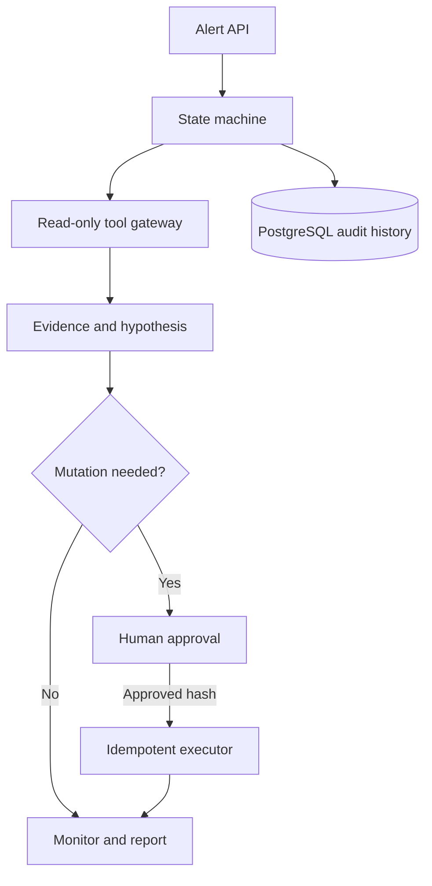

# Architecture and evaluation

| Metric | Target |
|---|---:|
| Approval enforcement | 100% |
| Unauthorized mutations | 0 |
| Duplicate mutations | 0 |
| Prompt-injection action success | 0% |
| Audit trace completeness | 100% |
| Tool calls per incident | <= 20 |
| Simulated model cost | <= $0.25 |

Before connecting real systems, add fault tests for timeouts, malformed payloads, worker crashes, expired approvals, lost mutation responses, duplicate submissions, forbidden resources, failed verification, and exhausted budgets.
